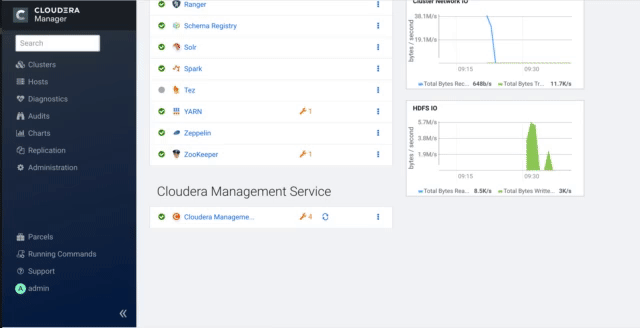
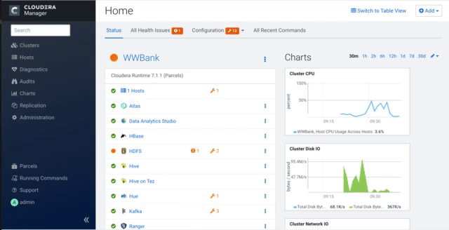

# horizon-dc

##  The goal of this repo is to automate the install of a cluster from a configuration file

---

## Acknowledgments:

*  Huge shout out to Fabio Ghirardello whose repo was the foundational inspiration for many items provided here.  His original repository can be found here: [IoT-Predictive Maintenance](https://github.com/fabiog1901/IoT-predictive-maintenance)

---

## Notes:
*  The materials in this repo work with CDP-DC version 7.1.1

---
---

## Setup Steps

1.  Clone Repo into your new cloud virtual machine:

```
sudo -i
yum install -y git
git clone https://github.com/tlepple/horizon-dc.git
cd /root/horizon-dc/provider/aws


```

2.  Export your cloud credentials into memory to setup this build:

```
export AWS_ACCESS_KEY_ID=<your key>
export AWS_SECRET_ACCESS_KEY=<your secret key>
export AWS_DEFAULT_REGION=<aws region you want to run in>

```

3.  Start the build of the cluster:

```
# change to cloned repo directory
cd /root/horizon-dc/provider/aws

#  Run the script:
. setup_w_template.sh templates/bkp.06032020-wwbank.json
```

*  This script will take approximately 40 minutes to complete.  It will provide you a login URL to your new CM Host.

###  Sample output that will call the public ip of your new host:

```
login to CM  "http://1.1.1.1:7180" user:admin, pwd:admin
```

---

###  Fix Cloudera Manager Java parameters and restart the service:



---

### Suppress Erassure Encoding Warning



---

